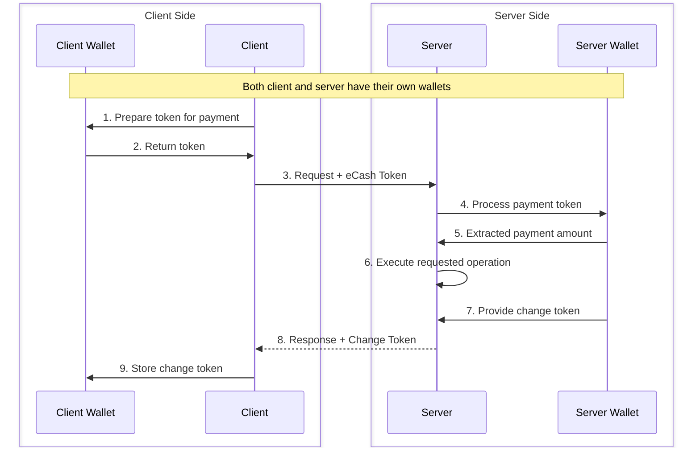
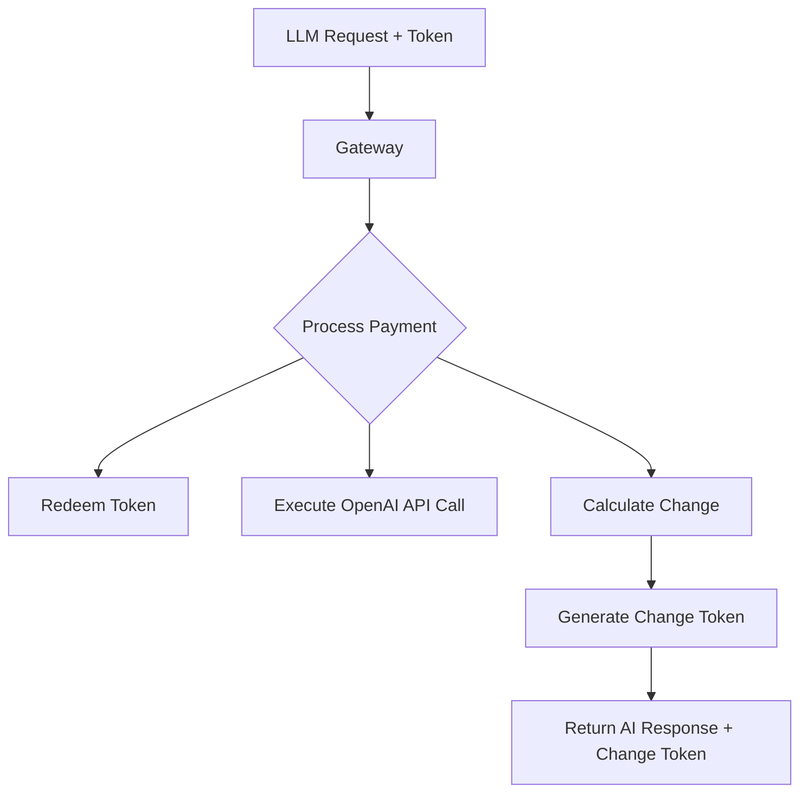
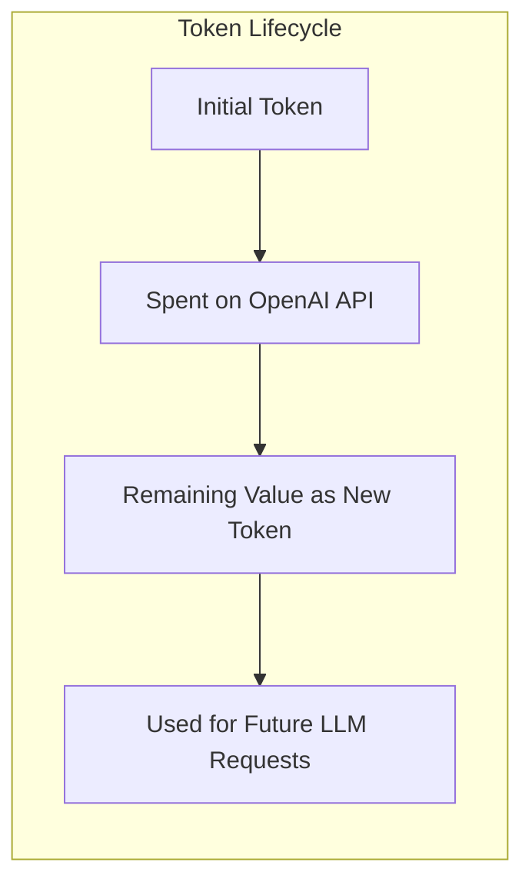

⚠️ **Don't be reckless:** This project is in early development, it does however work with real sats! Always use amounts you don't mind loosing.

**⚠️ IMPORTANT NOTE**: This README describes the project's end goal and vision. The current implementation is in early development, experimental, and not yet stable for production use. Features described here represent the intended functionality which is still being actively developed.

# Wallet Gateway

A privacy-focused payment gateway that enables anonymous micropayments using eCash (Cashu) tokens for accessing Large Language Models via the OpenAI API.

## Project Overview

Wallet Gateway provides a solution for using digital cash (eCash/Cashu) to pay for AI language model services anonymously. The system allows users to make OpenAI API requests accompanied by valid eCash tokens, which are then processed by the service provider. The provider redeems the token, extracts the required payment amount based on token usage, and returns any unused balance as change.

### Key Features

- **Anonymous AI Access**: Access OpenAI's language models without revealing your identity
- **Change Management**: Returns unused funds through a token-based approach
- **Fee Handling**: Options to manage mint fees through change tokens or private fee-free mints
- **API Compatibility**: Seamlessly works with standard OpenAI API endpoints

## How It Works

The diagram below illustrates the interaction between client and server components, each with their own wallet:



In this workflow:

1. The client prepares a payment using their wallet for an OpenAI API request
2. The wallet provides a valid ecash token
3. The client sends their LLM request with the token to the server
4. The server passes the token to its wallet for processing
5. The server wallet informs the server of the available amount
6. The server forwards the request to OpenAI and processes the AI model response
7. The server wallet provides a change token based on actual token usage
8. The server sends the OpenAI response with the change token
9. The client stores the change token in their wallet for future LLM requests

This approach maintains privacy while efficiently handling micropayments for AI services, as the server only extracts what's needed for the specific OpenAI API call and returns the remainder as change.

## The Micropayment Challenge for AI Services

Currently, the smallest unit in Bitcoin transactions is 1 satoshi, which creates a limitation for micropayments to language models:


This flowchart illustrates the fundamental challenge with Bitcoin micropayments for AI services:

- When an OpenAI API call costs less than 1 satoshi, there's no native way to pay the exact amount
- Users must either overpay (wasting value) or the service must batch multiple LLM requests (more complexity)
- This inefficiency becomes significant for high-volume, low-cost AI API calls like embeddings or short completions

## Our Solution

Wallet Gateway addresses the micropayment challenge for AI services through an innovative token-based approach:





This flowchart shows our solution:

- The gateway processes incoming tokens, taking only what's needed for the OpenAI API call
- Unused value is preserved by creating a change token
- The change token can be used for future LLM requests, preserving the full value
- This enables effectively fractional satoshi payments by tracking remaining value across multiple AI service requests

## Fee Management Options

There are two approaches to handling mint fees:

1. **Change Tokens**: Return unused funds as tokens for future use with AI services
2. **Private Fee-Free Mint**: Operate a private mint without fees

## Project Structure

- **Gateway**: API server handling token redemption and payment processing for OpenAI requests
- **Wallet**: Manages eCash tokens and communication with mints
- **Pay**: Handles cost calculation and payment verification for AI model usage

## Getting Started

### Running the Client

```bash
# Run the client component
docker-compose -f docker-compose.client.yaml up
```

### Token Management Workflow

1. **Get initial token**: Obtain a token from a Cashu mint
2. **Make OpenAI API request**: Send token with your LLM API request
3. **Save change token**: Store the returned change token from the response
4. **Use for next request**: Use the change token for subsequent AI service requests

This approach allows for efficient micropayments for AI services without losing value on small transactions.

## Contributing

Contributions are welcome! Please feel free to submit a Pull Request.

## License

This project is open source and available under the [MIT License](LICENSE).
