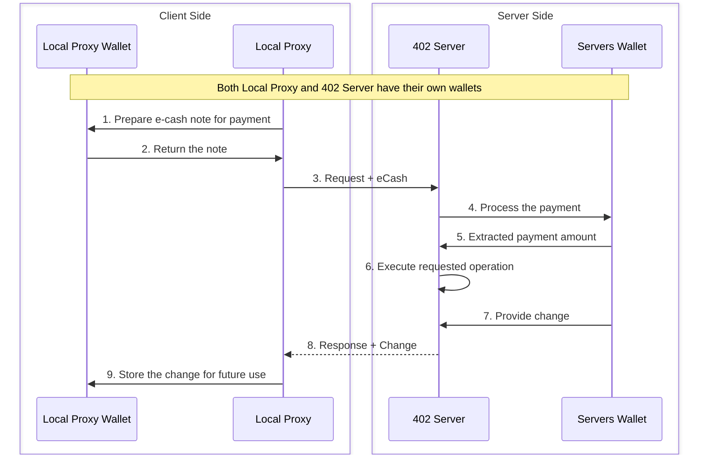
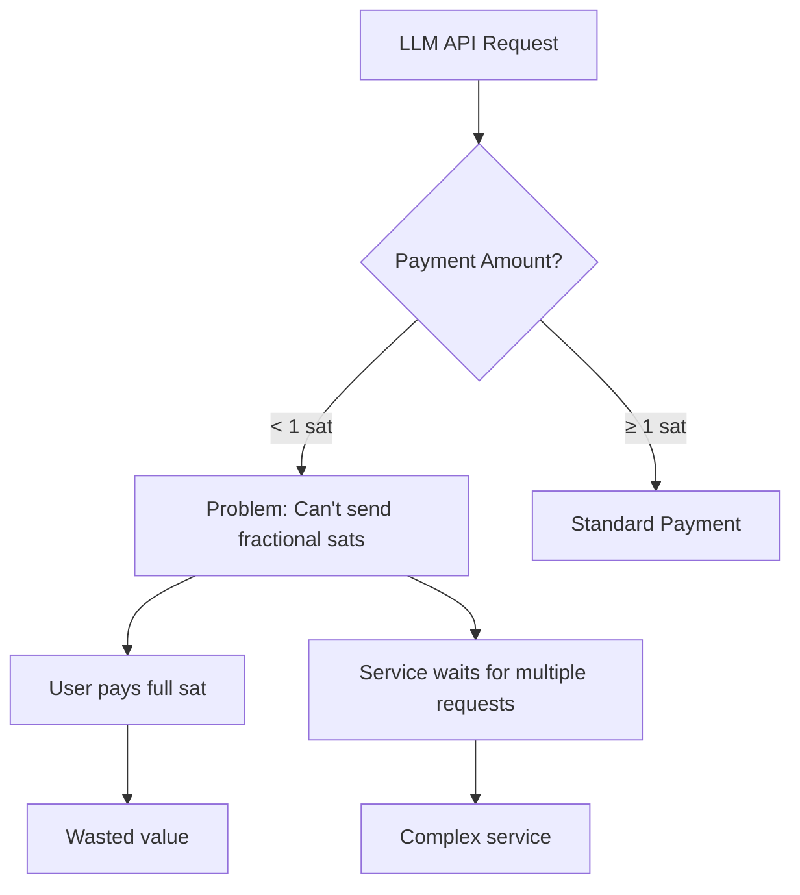
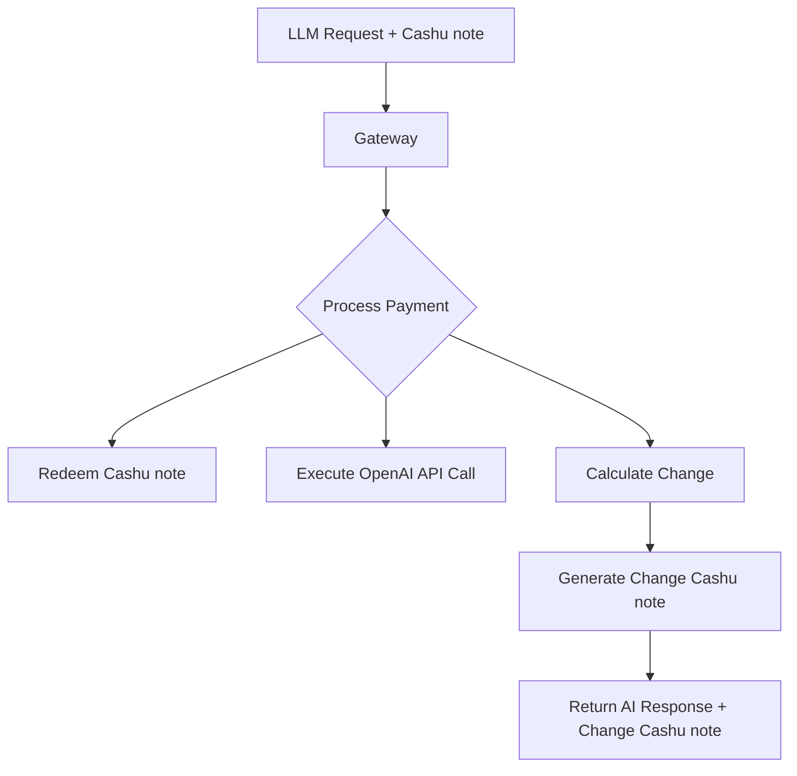
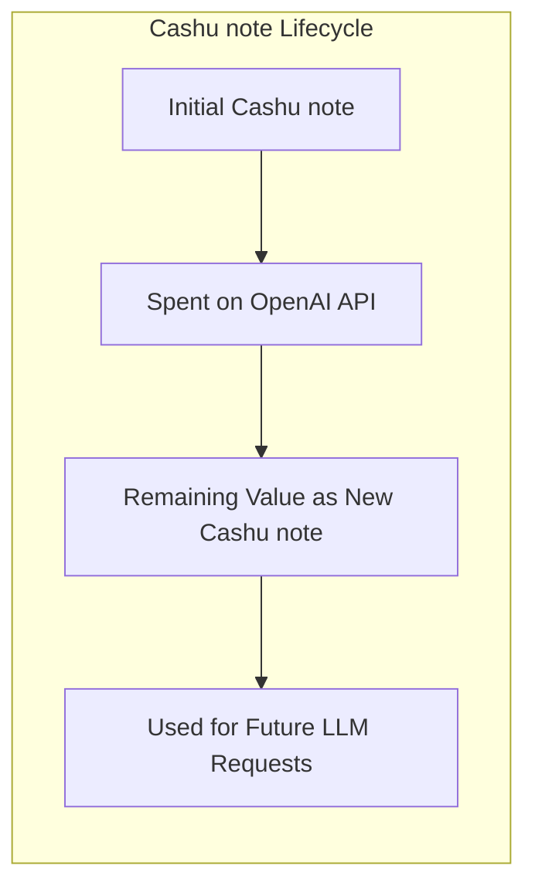

⚠️ **Don't be reckless:** This project is in early development, it does however work with real sats! Always use amounts you don't mind loosing.

**⚠️ IMPORTANT NOTE**: This README describes the project's end goal and vision. The current implementation is in early development, experimental, and not yet stable for production use. Features described here represent the intended functionality which is still being actively developed.

# Wallet Gateway

A privacy-focused payment gateway that enables anonymous micropayments using e-cash notes (also known as Cashu notes) for accessing Large Language Models via the OpenAI API.

## Project Overview

Wallet Gateway is a privacy-focused payment gateway that enables anonymous micropayments using e-cash notes (also known as Cashu notes) for accessing Large Language Models via the OpenAI API. On the client side, it provides a Local Proxy that manages these notes using the Local Proxy Wallet. The Local Proxy modifies API requests to include the notes. On the server side, the 402 Server acts as a wrapper around the OpenAI API, handling note redemption, payment processing, and change generation with the help of the Server's Wallet.

### Key Features

- **Anonymous AI Access**: Access OpenAI's language models without revealing your identity
- **Change Management**: Returns unused funds through a Cashu note-based approach
- **Fee Handling**: Options to manage mint fees through change notes or private fee-free mints
- **API Compatibility**: Seamlessly works with standard OpenAI API endpoints

## How It Works

The diagram below illustrates the interaction between client and server components, each with their own wallet:



In this workflow:

1. The Local Proxy prepares a payment using the Local Proxy Wallet for an OpenAI API request
2. The Local Proxy Wallet provides a valid e-cash note
3. The Local Proxy sends the LLM request with the note to the 402 Server
4. The 402 Server passes the note to the Server's Wallet for processing
5. The Server's Wallet informs the 402 Server of the available amount
6. The 402 Server forwards the request to OpenAI and processes the AI model response
7. The Server's Wallet provides a change note based on actual usage
8. The 402 Server sends the OpenAI response with the change
9. The Local Proxy stores the change in the Local Proxy Wallet for future LLM requests

This approach maintains privacy while efficiently handling micropayments for AI services, as the 402 Server only extracts what's needed for the specific OpenAI API call and returns the remainder as change.

## The Micropayment Challenge for AI Services

The Bitcoin network's limitation of 1 satoshi as the smallest transaction unit creates challenges for micropayments in AI services. This constraint particularly affects high-volume, low-cost AI API calls where transaction amounts are often fractions of a satoshi.

The following flow chart visualizes how we intend to address the problem:



This flowchart illustrates the fundamental challenge with Bitcoin micropayments for AI services:

- When an OpenAI API call costs less than 1 satoshi, there's no native way to pay the exact amount
- Users must either overpay (wasting value) or the service must batch multiple LLM requests (more complexity)
- This inefficiency becomes significant for high-volume, low-cost AI API calls like embeddings or short completions

## Our Solution

Wallet Gateway addresses the micropayment challenge for AI services through an innovative approach using Cashu notes. This method allows us to process AI requests without requiring user identity tracking for amounts above 1 satoshi, as we can return change directly in the HTTP response. The low overhead cost of using Cashu notes makes it feasible to handle frequent, granular transactions efficiently.

Wallet Gateway addresses the micropayment challenge for AI services through this innovative Cashu note-based approach:





This flowchart shows our solution:

- The gateway processes incoming Cashu notes, taking only what's needed for the OpenAI API call
- Unused value is preserved by creating a change Cashu note
- The change Cashu note can be used for future LLM requests, preserving the full value
- This enables effectively fractional satoshi payments by tracking remaining value across multiple AI service requests

## Fee Management Options

There are two approaches to handling mint fees:

1. **Change Cashu notes**: Return unused funds as Cashu notes for future use with AI services
2. **Private Fee-Free Mint**: Operate a private mint without fees

## Project Structure

- **Gateway**: API server handling Cashu note redemption and payment processing for OpenAI requests
- **Wallet**: Manages eCash (Cashu) notes and communication with mints
- **Pay**: Handles cost calculation and payment verification for AI model usage

## Getting Started

### Running the Client

```bash
# Run the client component
docker-compose -f docker-compose.client.yaml up
```

### Cashu note Management Workflow

1. **Get initial Cashu note**: Obtain a Cashu note from a Cashu mint
2. **Make OpenAI API request**: Send Cashu note with your LLM API request
3. **Save change Cashu note**: Store the returned change Cashu note from the response
4. **Use for next request**: Use the change Cashu note for subsequent AI service requests

This approach allows for efficient micropayments for AI services without losing value on small transactions.

## Contributing

Contributions are welcome! Please feel free to submit a Pull Request.

## License

This project is open source and available under the [MIT License](LICENSE).
